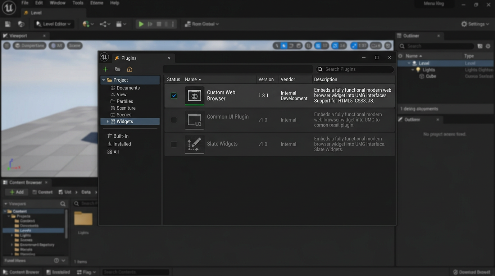
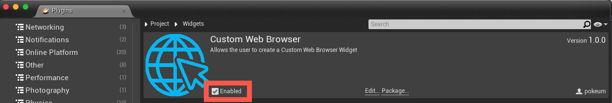

# Custom Web Browser for Unreal Engine

An Unreal Engine plugin that layers a **Custom Web Browser** widget on top of the engine's Web Browser stack. It adds a predictable **custom URL scheme** (`uewebbrowser://`) for page-to-game messages and works with **`SWebBrowser::BindUObject`** so JavaScript can call into your C++ or Blueprint-facing code.

## Overview

Use this when you need in-game UI or tools driven by HTML/CSS/JS, but want a simple contract from the web page back into Unreal: links or `location.href` that carry structured payloads without rolling your own CEF plumbing. The plugin focuses on navigation interception and message delivery; the stock **Web Browser Widget** dependency supplies the underlying browser runtime.



## Requirements

- **Web Browser Widget** plugin enabled in your project (the Custom Web Browser module depends on it).
- A **C++ project** (or C++-enabled project) if you bind handlers in code; Blueprint-only workflows still need the plugin enabled as below.

## Integrating the plugin

1. Copy [`demo/Shared/Plugins/CustomWebBrowser`](demo/Shared/Plugins/CustomWebBrowser) into your project's `Plugins` folder so you have:

   ```
   YourProject
      └── Plugins
            └── CustomWebBrowser
                  └── CustomWebBrowser.uplugin
   ```

2. **C++ projects:** add **CustomWebBrowser** to `PublicDependencyModuleNames` in your game module's `*.Build.cs`:

   ```csharp
   PublicDependencyModuleNames.AddRange(new string[] { /* ... */, "CustomWebBrowser" });
   ```

3. **Blueprint-only projects:** enable the plugin under **Edit → Plugins → Project → Widgets → Custom Web Browser**.

   |  |
   | --- |

## Messaging

### Send and receive

You can send a message from the web view to `CustomWebBrowser` to drive game logic from the page.

By binding **HandleOnBeforeBrowse** to **OnBeforeNavigation**, using an `FOnBeforeBrowse` delegate, Custom Web Browser inspects navigations whose URL starts with **`uewebbrowser://`**. If the user follows such a link, **OnMessageReceived** fires with the remainder of the URL after the scheme.

Example page:

```html
<a href="uewebbrowser://action?key=value&anotherKey=anotherValue">Tap me</a>
```

Example C++ wiring:

**Header (`.h`):**

```cpp
#pragma once

#include "Blueprint/UserWidget.h"
#include "WebViewWidget.generated.h"

class UCustomWebBrowser;

UCLASS()
class DEMO_API UMainMenuWidget : public UUserWidget
{
   GENERATED_BODY()

   // ...

protected:
   UPROPERTY(BlueprintReadWrite, meta = (BindWidget))
   UCustomWebBrowser* CustomWebBrowser;

private:
   UFUNCTION()
   void OnMessageReceived(FString Message);
};
```

**Source (`.cpp`):**

```cpp
#include "Widget/CustomWebBrowser.h"

if (CustomWebBrowser != nullptr)
{
   CustomWebBrowser->OnMessageReceived.AddDynamic(this, &UMainMenuWidget::OnMessageReceived);
}

void UMainMenuWidget::OnMessageReceived(FString Message)
{
   UE_LOG(LogTemp, Warning, TEXT("%s"), *Message);
}
```

Tapping the link logs:

```
action?key=value&anotherKey=anotherValue
```

**Navigation note:** In addition to an `<a href>`, assigning `location.href` in JavaScript triggers the same path:

```js
location.href = "uewebbrowser://action?key=value&anotherKey=anotherValue";
```

### `SWebBrowser::BindUObject`

Using [`SWebBrowser::BindUObject`](https://dev.epicgames.com/documentation/en-us/unreal-engine/API/Runtime/WebBrowser/SWebBrowser/BindUObject), the Custom Web Browser instance can be exposed to the page so script can invoke Unreal-side methods directly.

Example (equivalent effect to the link above):

```js
window.ue.uewebbrowser.sendmessage("action?key=value&anotherKey=anotherValue");
```

## References

- [Unreal Engine: `SWebBrowser::BindUObject`](https://dev.epicgames.com/documentation/en-us/unreal-engine/API/Runtime/WebBrowser/SWebBrowser/BindUObject)
- [UniWebView: messaging concepts](https://docs.uniwebview.com/guide/messaging-system.html) (similar pattern; third-party documentation)

- Add a unit test for the edge case when the list is empty

- Update the contributing guide with the new review process

- Support both relative and absolute paths for the config file

- Simplify the dependency injection so it's easier to mock in tests

- Correct the default so it matches what the documentation says

- Add a comment explaining why we disable the linter on this line

- Correct the formula used for calculating the backoff delay

- Correct the default path used when no config file is specified

- Bump the Docker base image to get the latest security patches

- Add integration tests for the new export endpoint

- Support config reload without restart via SIGHUP or file watch

- Update the contributing guide with the new review process

- Improve logging so we can trace requests through the pipeline in production

- Update the deployment docs with the new environment variables

- Add proper error handling for invalid config so the app doesn't crash on startup

- Refactor utils to use a single source of truth for default values

- Adjust timeout and retry settings based on production observations

- Correct typo in the error message shown when validation fails

- Clean up leftover code from the previous implementation

- Implement a simple metrics endpoint for Prometheus scraping

- Correct the logic that determined whether to use cache or not

- Bump the library version and pin the dependency in requirements

- Remove the unused parameter that was left from an old refactor

- Simplify the dependency injection so it's easier to mock in tests

- Correct the default path used when no config file is specified

- Improve error message when the required env var is not set

- Clean up duplicate logic between the sync and async code paths

- Improve performance by caching the result of the expensive lookup

- Bump the version and tag the release in the repo

- Fix the memory leak in the long-running worker process

- Simplify the dependency injection so it's easier to mock in tests

- Improve test coverage for the helpers module to above 90%

- Bump the CI image to use the latest stable runner version

- Support custom headers in the client for API key or auth tokens

- Refactor config loading into a separate module for better testability

- Update the license file and add the new third-party notices

- Simplify the dependency injection so it's easier to mock in tests

- Fix the ordering of middleware so auth runs before the handler

- Correct the timestamp format to use ISO 8601 for consistency

- Adjust buffer size for the stream reader to reduce memory usage

- Bump version to 1.2.0 and add changelog entry for the new features

- Simplify the config validation by using a declarative schema

- Refactor the parser to use a proper state machine instead of regex

- Improve performance by caching the result of the expensive lookup

- Adjust the pool size to match the actual concurrency we need

- Add a unit test for the edge case when the list is empty

- Adjust the pool size to match the actual concurrency we need

- Correct the default path used when no config file is specified

- Refactor exports so the public API is clearer and easier to use

- Handle the redirect response and follow it to get the final resource

- Fix incorrect type hint that was causing mypy to fail in CI

- Simplify error messages so they are actionable for the end user

- Bump minimum Python version to 3.10 and update type hints accordingly

- Improve the CLI help text so it's clear how to use each option

- Simplify the config merge logic so overrides are predictable

- Update the deployment docs with the new environment variables

- Add a unit test for the edge case when the list is empty

- Clean up duplicate logic between the sync and async code paths

- Correct the default value for the feature flag in production

- Remove the feature flag now that the feature is fully rolled out

- Adjust default timeout value to prevent premature connection drops

- Adjust the batch size to reduce memory usage on large inputs

- Handle timeout gracefully and return a clear error to the caller

- Bump the Docker base image to get the latest security patches

- Handle the redirect response and follow it to get the final resource

- Bump the tool version and update the pre-commit hook config

- Implement a small in-memory cache for the config to avoid re-reading

- Simplify the build script by using the same steps for dev and prod

- Add a small delay between retries to avoid thundering herd

- Support custom headers in the client for API key or auth tokens

- Remove the deprecated wrapper and use the library API directly

- Bump the Docker base image to get the latest security patches

- Improve logging so we can trace requests through the pipeline in production

- Add integration test that covers the full flow from request to response

- Remove the feature flag now that the feature is fully rolled out

- Refactor exports so the public API is clearer and easier to use

- Bump the tool version and update the pre-commit hook config

- Support custom headers in the client for API key or auth tokens

- Update README with installation steps and environment variable documentation

- Fix issue where empty input was not validated before passing to the parser

- Clean up leftover code from the previous implementation

- Correct the default value for the feature flag in production

- Update the example config with all available options and comments

- Simplify the validation flow by reusing the same schema

- Add a note in the README about the breaking change in 2.0

- Refactor utils to use a single source of truth for default values

- Remove the deprecated wrapper and use the library API directly

- Support config reload without restart via SIGHUP or file watch

- Simplify the build script by using the same steps for dev and prod

- Bump the CI image to use the latest stable runner version

- Support custom headers in the client for API key or auth tokens

- Bump the tool version and update the pre-commit hook config
